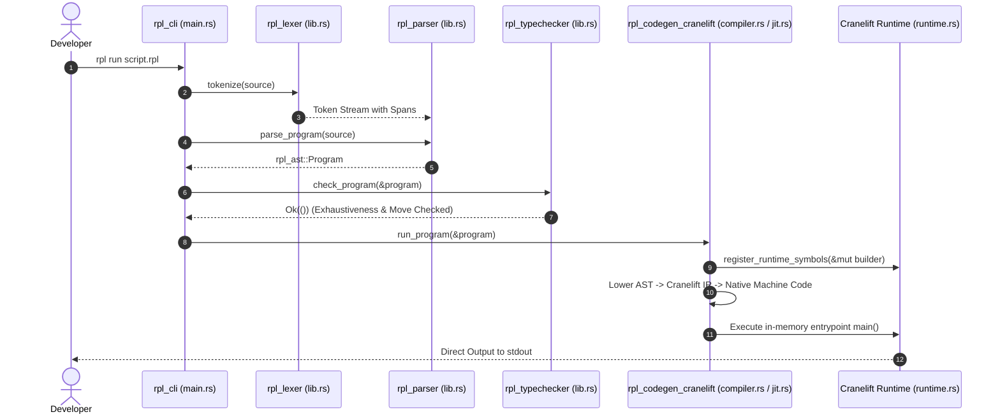
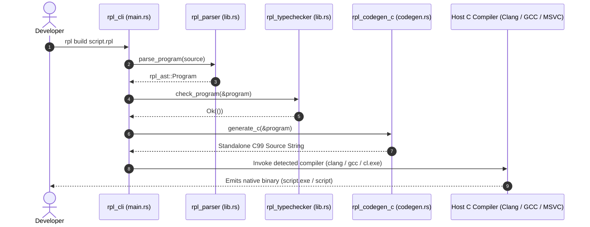
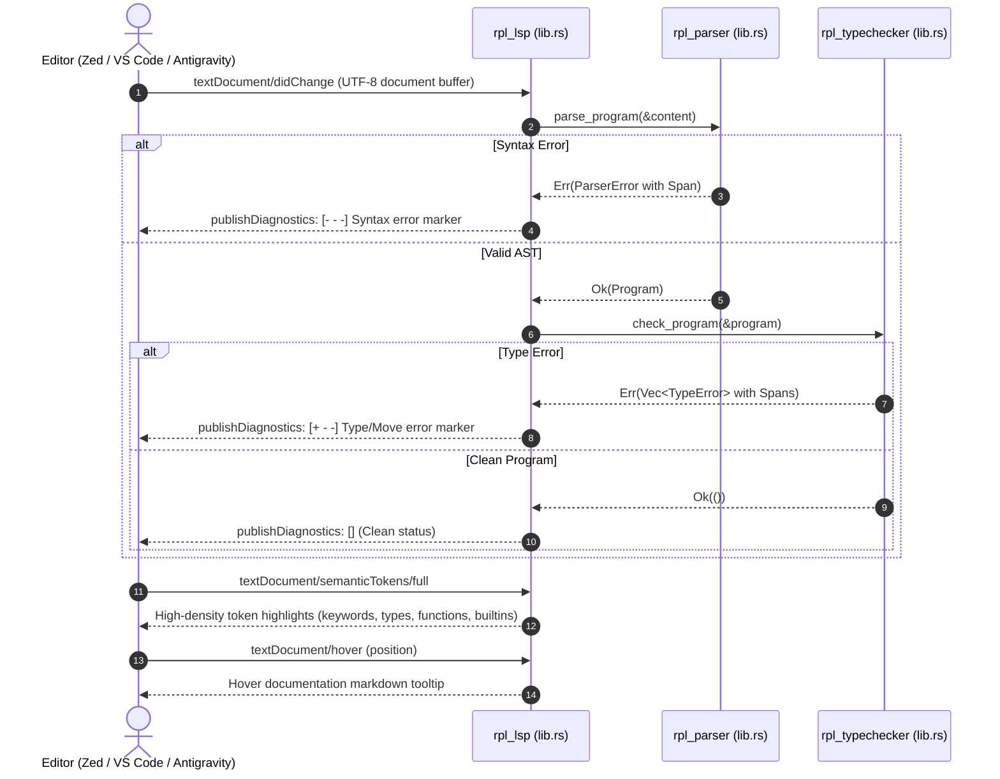

# RPL — ARCHITECTURAL SYMBOL & CODE MAP (docs/agent/CODE_MAP.md)
Document ID: RPL-CODE-MAP-2026-V1  
Role: Living Codebase Index & Architectural Topography (Ground Truth)  
Target Audience: Autonomous AI Agents & Compiler Engineers (Ground Truth)  
Scope: Centralized Single Source of Truth for Codebase Symbols, Signatures & Dependencies  
Author: RPL Core Compiler Team  
Status: ACTIVE & MANDATORY REFERENCE  

> [!IMPORTANT]
> **PRE-INSPECTION MANDATORY CHECK (ANTI-BROWSING DISCIPLINE):**
> Before executing any file inspection, full-text grep, or broad repository search, autonomous coding agents (Claude Code, Cursor, Zed AI, Antigravity) are strictly required to consult this document first. Locate the responsible module via the Master File Index in Section 1.2 or Master Symbol Directory in Section 5, and open only targeted lines surgically.

---

## 1. Table of Contents & Quick Jump Matrix

### 1.1. High-Level Navigation
- [1. Table of Contents & Quick Jump Matrix](#1-table-of-contents--quick-jump-matrix)
  - [1.2. Master File Index & Fast Navigation Matrix](#12-master-file-index--fast-navigation-matrix)
- [2. System Architecture & Crate Graph](#2-system-architecture--crate-graph)
  - [2.1. Workspace Dependency Topology](#21-workspace-dependency-topology)
  - [2.2. End-to-End Compilation Pipeline](#22-end-to-end-compilation-pipeline)
- [3. Crates & Modules Detailed Breakdown](#3-crates--modules-detailed-breakdown)
  - [3.1. Crate: rpl_ast](#31-crate-rpl_ast)
  - [3.2. Crate: rpl_lexer](#32-crate-rpl_lexer)
  - [3.3. Crate: rpl_parser](#33-crate-rpl_parser)
  - [3.4. Crate: rpl_typechecker](#34-crate-rpl_typechecker)
  - [3.5. Crate: rpl_codegen_c](#35-crate-rpl_codegen_c)
  - [3.6. Crate: rpl_codegen_cranelift](#36-crate-rpl_codegen_cranelift)
  - [3.7. Crate: rpl_lsp](#37-crate-rpl_lsp)
  - [3.8. Crate: rpl_cli](#38-crate-rpl_cli)
  - [3.9. Test Fixtures & Official Examples](#39-test-fixtures--official-examples)
- [4. Component Interaction & Pipeline Flow (Who Calls What)](#4-component-interaction--pipeline-flow-who-calls-what)
  - [4.1. JIT Execution Flow (rpl run)](#41-jit-execution-flow-rpl-run)
  - [4.2. C99 Transpilation Flow (rpl build)](#42-c99-transpilation-flow-rpl-build)
  - [4.3. Built-in Function & Two-Tier I/O Dispatch Flow](#43-built-in-function--two-tier-io-dispatch-flow)
  - [4.4. Real-Time Language Server Flow (rpl lsp)](#44-real-time-language-server-flow-rpl-lsp)
- [5. Master Symbol Directory](#5-master-symbol-directory)
  - [5.1. rpl_ast Symbols](#51-rpl_ast-symbols)
  - [5.2. rpl_lexer Symbols](#52-rpl_lexer-symbols)
  - [5.3. rpl_parser Symbols](#53-rpl_parser-symbols)
  - [5.4. rpl_typechecker Symbols](#54-rpl_typechecker-symbols)
  - [5.5. rpl_codegen_c Symbols](#55-rpl_codegen_c-symbols)
  - [5.6. rpl_codegen_cranelift Symbols](#56-rpl_codegen_cranelift-symbols)
  - [5.7. rpl_lsp Symbols](#57-rpl_lsp-symbols)
  - [5.8. rpl_cli Symbols](#58-rpl_cli-symbols)
- [6. Language Invariants & Documentation Taxonomy Matrix](#6-language-invariants--documentation-taxonomy-matrix)
- [7. Maintenance Contract & Definition of Done](#7-maintenance-contract--definition-of-done)

---

### 1.2. Master File Index & Fast Navigation Matrix

Quick lookup matrix for surgical navigation. Agents should consult this table to locate responsible files in seconds:

| Target File | Crate / Scope | Primary Concern / Responsibility | Key Public Symbols | Jump to Breakdown |
| :--- | :--- | :--- | :--- | :--- |
| `crates/rpl_ast/src/lib.rs` | `rpl_ast` | Crate root and module re-exports. | `Span`, `Literal`, `Type`, `Expr`, `Stmt`, `Program` | [View 3.1](#31-crate-rpl_ast) |
| `crates/rpl_ast/src/span.rs` | `rpl_ast` | Byte offsets & 1-based line/col source coordinates. | `Span`, `Spanned` | [View 3.1](#31-crate-rpl_ast) |
| `crates/rpl_ast/src/literal.rs` | `rpl_ast` | Primitive values & Kleene 3-valued logic truth algebra. | `Literal`, `TritValue` (`True`, `False`, `Unknown`) | [View 3.1](#31-crate-rpl_ast) |
| `crates/rpl_ast/src/types.rs` | `rpl_ast` | Static type system representations. | `Type` (`Int`, `Float`, `String`, `Bool`, `Trit`, `File`, `Void`, `List`, `Map`, `Custom`, `Fn`) | [View 3.1](#31-crate-rpl_ast) |
| `crates/rpl_ast/src/op.rs` | `rpl_ast` | Binary & unary operator definitions. | `BinaryOp`, `UnaryOp` | [View 3.1](#31-crate-rpl_ast) |
| `crates/rpl_ast/src/expr.rs` | `rpl_ast` | Recursive expression tree nodes & interpolation fragments. | `Expr`, `InterpolationFragment` | [View 3.1](#31-crate-rpl_ast) |
| `crates/rpl_ast/src/stmt.rs` | `rpl_ast` | Statements, declarations, patterns, blocks, and program root. | `Program`, `Stmt`, `Pattern`, `VarDecl`, `Assign`, `FnDecl`, `Block` | [View 3.1](#31-crate-rpl_ast) |
| `crates/rpl_ast/src/error.rs` | `rpl_ast` | AST validation errors. | `AstError` | [View 3.1](#31-crate-rpl_ast) |
| `crates/rpl_ast/tests/ast_tests.rs` | `rpl_ast` | Unit tests for AST nodes, display representations, and Kleene truth tables. | Test Suite (9 tests) | [View 3.1](#31-crate-rpl_ast) |
| `crates/rpl_lexer/src/lib.rs` | `rpl_lexer` | Logos-based tokenizer with depth-aware newline emission. | `RplLexer`, `tokenize` | [View 3.2](#32-crate-rpl_lexer) |
| `crates/rpl_lexer/src/token.rs` | `rpl_lexer` | 28 reserved keywords, operators, symbols, and literals. | `Token` enum | [View 3.2](#32-crate-rpl_lexer) |
| `crates/rpl_lexer/src/interpolation.rs`| `rpl_lexer` | Detection and splitting of `$var` and `$(expr)` fragments. | `split_interpolation` | [View 3.2](#32-crate-rpl_lexer) |
| `crates/rpl_lexer/src/error.rs` | `rpl_lexer` | Lexical analysis syntax errors with spans. | `LexerError` | [View 3.2](#32-crate-rpl_lexer) |
| `crates/rpl_lexer/tests/lexer_tests.rs`| `rpl_lexer` | Tests for tokenization, newline filtering, and interpolation. | Test Suite (9 tests) | [View 3.2](#32-crate-rpl_lexer) |
| `crates/rpl_parser/src/lib.rs` | `rpl_parser` | Lookahead token stream parser & program entrypoint. | `Parser`, `parse_program`, `parse_expression` | [View 3.3](#33-crate-rpl_parser) |
| `crates/rpl_parser/src/expr.rs` | `rpl_parser` | Pratt parser (Precedence Climbing) for expressions and pipes. | `Precedence`, `parse_expr_with_precedence` | [View 3.3](#33-crate-rpl_parser) |
| `crates/rpl_parser/src/stmt.rs` | `rpl_parser` | Recursive descent statement parser, scoping, block delimiters (`:`/`end`). | `parse_statement`, `parse_block`, `parse_type` | [View 3.3](#33-crate-rpl_parser) |
| `crates/rpl_parser/src/error.rs` | `rpl_parser` | Detailed syntax diagnostics with actionable span hints. | `ParserError` | [View 3.3](#33-crate-rpl_parser) |
| `crates/rpl_parser/tests/parser_tests.rs` | `rpl_parser` | Comprehensive test suite for statements, expressions, loops, and pipes. | Test Suite (20 tests) | [View 3.3](#33-crate-rpl_parser) |
| `crates/rpl_typechecker/src/lib.rs` | `rpl_typechecker`| Semantic validation entrypoint. | `check_program`, `check_expression` | [View 3.4](#34-crate-rpl_typechecker) |
| `crates/rpl_typechecker/src/checker.rs` | `rpl_typechecker`| AST type checker, Kleene logic rules, Trit match exhaustiveness, affine move checks. | `TypeChecker`, `check_stmt`, `check_expr` | [View 3.4](#34-crate-rpl_typechecker) |
| `crates/rpl_typechecker/src/env.rs` | `rpl_typechecker`| Scoped symbol tables, mutability tracking, initialization & move states. | `Environment`, `SymbolState` (`Uninit`, `Valid`, `Moved`) | [View 3.4](#34-crate-rpl_typechecker) |
| `crates/rpl_typechecker/src/error.rs` | `rpl_typechecker`| Compile-time semantic error definitions. | `TypeError` | [View 3.4](#34-crate-rpl_typechecker) |
| `crates/rpl_typechecker/tests/typechecker_tests.rs` | `rpl_typechecker`| Tests for typing rules, Kleene truth tables, and affine move tracking. | Test Suite (16 tests) | [View 3.4](#34-crate-rpl_typechecker) |
| `crates/rpl_codegen_c/src/lib.rs` | `rpl_codegen_c` | C99 transpiler backend entrypoint. | `generate_c` | [View 3.5](#35-crate-rpl_codegen_c) |
| `crates/rpl_codegen_c/src/codegen.rs` | `rpl_codegen_c` | Translation of AST nodes to readable, optimized C99 source. | `CGenerator` | [View 3.5](#35-crate-rpl_codegen_c) |
| `crates/rpl_codegen_c/src/runtime.rs` | `rpl_codegen_c` | Self-contained C99 runtime header with Two-Tier I/O & Trit logic. | `RPL_RUNTIME_H`, `rpl_file_t`, `rpl_input`, `rpl_read_file` | [View 3.5](#35-crate-rpl_codegen_c) |
| `crates/rpl_codegen_c/src/types.rs` | `rpl_codegen_c` | Mapping RPL types to C types (`rpl_file_t`, `rpl_trit_t`, etc.). | `to_c_type`, `to_c_return_type` | [View 3.5](#35-crate-rpl_codegen_c) |
| `crates/rpl_codegen_c/src/error.rs` | `rpl_codegen_c` | C transpilation error definitions. | `CodegenError` | [View 3.5](#35-crate-rpl_codegen_c) |
| `crates/rpl_codegen_c/tests/codegen_tests.rs` | `rpl_codegen_c` | Tests for C generation and host C compiler invocation. | Test Suite (8 tests) | [View 3.5](#35-crate-rpl_codegen_c) |
| `crates/rpl_codegen_cranelift/src/lib.rs` | `rpl_codegen_cranelift` | In-memory Cranelift JIT execution entrypoint. | `run_program` | [View 3.6](#36-crate-rpl_codegen_cranelift) |
| `crates/rpl_codegen_cranelift/src/compiler.rs` | `rpl_codegen_cranelift` | AST to Cranelift IR lowering, register allocation for Trit, struct stack slots, pipe dispatch. | `FunctionCompiler`, `compile_function` | [View 3.6](#36-crate-rpl_codegen_cranelift) |
| `crates/rpl_codegen_cranelift/src/jit.rs` | `rpl_codegen_cranelift` | Host ISA configuration, memory allocation, and JIT execution engine. | `JITCompiler` | [View 3.6](#36-crate-rpl_codegen_cranelift) |
| `crates/rpl_codegen_cranelift/src/runtime.rs` | `rpl_codegen_cranelift` | C-ABI runtime helpers (`rpl_jit_*`), Two-Tier I/O, `JitFile`, symbol registration. | `register_runtime_symbols`, `JitFile` | [View 3.6](#36-crate-rpl_codegen_cranelift) |
| `crates/rpl_codegen_cranelift/src/types.rs` | `rpl_codegen_cranelift` | Cranelift type mappings (`rpl_to_cl_type`) and memory layouts. | `rpl_to_cl_type`, `compute_struct_layout` | [View 3.6](#36-crate-rpl_codegen_cranelift) |
| `crates/rpl_codegen_cranelift/src/error.rs` | `rpl_codegen_cranelift` | JIT compilation and execution errors. | `CodegenCraneliftError` | [View 3.6](#36-crate-rpl_codegen_cranelift) |
| `crates/rpl_codegen_cranelift/tests/jit_tests.rs` | `rpl_codegen_cranelift` | Tests for JIT arithmetic, loops, struct layouts, Two-Tier I/O, and reaktor simulation. | Test Suite (6 tests) | [View 3.6](#36-crate-rpl_codegen_cranelift) |
| `crates/rpl_lsp/src/lib.rs` | `rpl_lsp` | Zero-dependency Language Server Protocol daemon implementation. | `Backend`, `main_loop`, `compute_semantic_tokens` | [View 3.7](#37-crate-rpl_lsp) |
| `crates/rpl_lsp/src/backend.rs` | `rpl_lsp` | LSP initialization, server info, dynamic VERSION reader, and capability negotiation. | `ServerCapabilities`, `Backend` | [View 3.7](#37-crate-rpl_lsp) |
| `crates/rpl_lsp/tests/lsp_tests.rs` | `rpl_lsp` | Tests for diagnostics, semantic tokens, and live hovers. | Test Suite (7 tests) | [View 3.7](#37-crate-rpl_lsp) |
| `crates/rpl_cli/src/main.rs` | `rpl_cli` | CLI entrypoint, argument parsing, compiler detection, and subcommand dispatch. | `Cli`, `Commands`, `main` | [View 3.8](#38-crate-rpl_cli) |
| `crates/rpl_cli/tests/cli_tests.rs` | `rpl_cli` | End-to-end integration tests, dynamic VERSION assertion, and official fixture suite runner. | Test Suite (8 tests) | [View 3.8](#38-crate-rpl_cli) |
| `tests/fixtures/io_complete.rpl` | Fixtures | Comprehensive test fixture for Two-Tier I/O (Layer 1 atomic + Layer 2 streams). | Test Script | [View 3.9](#39-test-fixtures--official-examples) |
| `tests/fixtures/io_use_after_close.rpl` | Fixtures | Negative compile-time test fixture verifying affine ownership rejection (`Use of moved value`). | Negative Test Script | [View 3.9](#39-test-fixtures--official-examples) |
| `tests/fixtures/control_flow.rpl` | Fixtures | Test fixture verifying `if/else`, range `for in ..`, and `match`. | Test Script | [View 3.9](#39-test-fixtures--official-examples) |
| `tests/fixtures/functions_pipeline.rpl` | Fixtures | Test fixture verifying function declarations, pipe operator (`|>`), and lambdas. | Test Script | [View 3.9](#39-test-fixtures--official-examples) |
| `examples/daemon_logger.rpl` | Examples | Production-style system daemon demonstrating stream logging and telemetry. | Example Script | [View 3.9](#39-test-fixtures--official-examples) |
| `docs/README.md` | Docs Index | Complete documentation system index and decoupled 3-tier taxonomy. | Navigation Index | [View Docs](../README.md) |
| `docs/agent/CODE_MAP.md` | Ground Truth | Living codebase index, symbols, and module topography. | Architectural Map | [View 1.1](#11-high-level-navigation) |
| `docs/agent/COMPILER_CAPABILITIES.md` | Ground Truth | Authoritative matrix of what 100% compiles & runs today. | Capability Matrix | [View Docs](COMPILER_CAPABILITIES.md) |
| `docs/spec/PROJECT_SPEC.md` | Spec / RFC | Formal grammar, syntax targets, and long-term language design vision. | Specification | [View Docs](../spec/PROJECT_SPEC.md) |
| `docs/spec/ROADMAP.md` | Vision / RFC | Strategic evolution and priority-tiered roadmap (0.1 → 1.0). | Strategic Plan | [View Docs](../spec/ROADMAP.md) |
| `docs/user/LANGUAGE_GUIDE.md` | User Guide | Hands-on tutorial and programming guide for active 0.2 milestone. | User Guide | [View Docs](../user/LANGUAGE_GUIDE.md) |
| `docs/user/IDE_SETUP.md` | User Tooling | Language Server Protocol (`rpl lsp`) editor configuration guide. | Setup Guide | [View Docs](../user/IDE_SETUP.md) |
| `VERSION` | Root SSoT | Sole Single Source of Truth for the active release version string. | `0.2+4 "Tohtlane"` | [View 6](#6-language-invariants--documentation-taxonomy-matrix) |
| `CHANGELOG.md` | Root Ledger | Chronological ledger of past releases and changes. | Release History | [View 6](#6-language-invariants--documentation-taxonomy-matrix) |
| `AGENTS.md` | Root Rules | Mandatory agent directives, operational boundaries, and verification checklists. | Agent Directives | [View 6](#6-language-invariants--documentation-taxonomy-matrix) |

---

## 2. System Architecture & Crate Graph

RPL is structured as a modular, 100% pure Rust workspace with zero GC overhead and a dual-backend compilation architecture.

```text
                                  RPL Source Code (.rpl)
                                            │
                                            ▼
           crates/rpl_lexer (Logos tokenizer, bracket depth, depth-0 newlines)
                                            │ Stream of (Token, Span)
                                            ▼
           crates/rpl_parser (Recursive Descent Stmts + Pratt Operator Precedence)
                                            │ rpl_ast::Program
                                            ▼
           crates/rpl_typechecker (Kleene 3-state logic, type check, affine moves)
                                            │ Validated AST
                    ┌───────────────────────┴───────────────────────┐
                    ▼                                               ▼
  crates/rpl_codegen_cranelift (Phase 2)          crates/rpl_codegen_c (Phase 1)
  In-Memory JIT Compiler & C-ABI Runtime          Self-Contained C99 Transpiler
                    │                                               │
                    ▼                                               ▼
         Direct Machine Execution                   Target C Compiler (Clang/GCC/MSVC)
         (Sub-10ms latency via rpl run)              (Standalone Native Binary)
```

### 2.1. Workspace Dependency Topology

```text
rpl_cli ──────────────────────┐
  ├── rpl_ast                 │
  ├── rpl_lexer               │
  ├── rpl_parser              │
  ├── rpl_typechecker         ├──> crates/rpl_lsp
  ├── rpl_codegen_c           │      ├── rpl_ast
  └── rpl_codegen_cranelift   │      ├── rpl_parser
                              │      └── rpl_typechecker
                              │
rpl_codegen_cranelift ────────┘
  ├── rpl_ast
  └── cranelift / cranelift-jit / cranelift-module

rpl_codegen_c
  └── rpl_ast

rpl_typechecker
  └── rpl_ast

rpl_parser
  ├── rpl_ast
  └── rpl_lexer

rpl_lexer
  ├── rpl_ast (Span)
  └── logos
```

---

## 3. Crates & Modules Detailed Breakdown

### 3.1. Crate: `rpl_ast`
- **Location:** `crates/rpl_ast/`
- **Role:** Pure data structures defining the strongly-typed Abstract Syntax Tree. Free of compiler logic or parser side-effects.
- **Key Modules & Files:**
  - `src/lib.rs`: Re-exports `Span`, `Literal`, `TritValue`, `Type`, `BinaryOp`, `UnaryOp`, `Expr`, `Stmt`, `Program`.
  - `src/span.rs`: `Span` defines byte offsets `[start..end]` and 1-based `(start_line, start_col, end_line, end_col)` diagnostics coordinates.
  - `src/literal.rs`:
    - `Literal`: `Int(i64)`, `Float(f64)`, `String(String)`, `Bool(bool)`, `Trit(TritValue)`.
    - `TritValue`: 3-valued Kleene logic variants: `True`, `False`, `Unknown`. Implements ternary `and`, `or`, `not`.
  - `src/types.rs`:
    - `Type`: `Int`, `Float`, `String`, `Bool`, `Trit`, `File` (opaque stream handle), `Void`, `List(Box<Type>)`, `Map(Box<Type>, Box<Type>)`, `Custom(String)`, `Fn(Vec<Type>, Box<Type>)`.
  - `src/op.rs`:
    - `BinaryOp`: Arithmetic (`+`, `-`, `*`, `/`, `%`), Comparison (`==`, `!=`, `<`, `<=`, `>`, `>=`), Logical (`and`, `or`), Bitwise/Shift, Pipe (`|>`), Range (`..`).
    - `UnaryOp`: Negation (`-`), Logical Not (`not`), Bitwise Not.
  - `src/expr.rs`:
    - `Expr`: Recursive expression tree enum: `Literal`, `Ident`, `Binary`, `Unary`, `Call`, `MemberAccess`, `Index`, `Lambda`, `ListLiteral`, `MapLiteral`, `InterpolatedString`.
    - `InterpolationFragment`: `Literal(String)` and `Expr(Box<Expr>)` for `$var` / `$(expr)`.
  - `src/stmt.rs`:
    - `Program`: Root AST node containing `Vec<Stmt>`.
    - `Stmt`: `Let`, `MutLet`, `Assign`, `FnDecl`, `TypeDecl`, `If`, `Match`, `For`, `ParallelFor`, `Spawn`, `Return`, `Expr`. (Note: `while` is not yet an AST statement).
    - `Pattern`: Match case patterns including literals, identifiers, wildcards, and Trit variants.
  - `src/error.rs`: `AstError` error definitions via `thiserror`.

---

### 3.2. Crate: `rpl_lexer`
- **Location:** `crates/rpl_lexer/`
- **Role:** Converts raw UTF-8 `.rpl` source code into `(Token, Span)` pairs with line/column tracking.
- **Key Modules & Files:**
  - `src/lib.rs`:
    - `RplLexer<'a>`: Iterator wrapping `logos::Lexer`.
    - Tracks bracket depth (`()`, `[]`) to ignore insignificant newlines within arguments while emitting semantic `Token::Newline` statement terminators at depth 0.
  - `src/token.rs`:
    - `Token`: 28 reserved keywords (`fn`, `let`, `mut`, `if`, `else`, `match`, `for`, `in`, `parallel`, `spawn`, `return`, `end`, `true`, `false`, `unknown`, `trit`, etc.), literals, symbols, and operators.
  - `src/interpolation.rs`:
    - `split_interpolation`: Detects and segments `$ident` and `$(expr)` within interpolated strings.
  - `src/error.rs`:
    - `LexerError`: Structured syntax errors with spans (`UnterminatedString`, `InvalidNumberLiteral`, `UnexpectedCharacter`).

---

### 3.3. Crate: `rpl_parser`
- **Location:** `crates/rpl_parser/`
- **Role:** Parses the token stream into `rpl_ast::Program`.
- **Parsing Strategy:**
  - **Statements & Declarations:** Recursive Descent.
  - **Expressions:** Pratt parsing (Precedence Climbing) for mathematical, logical, and pipe (`|>`) operators.
- **Key Modules & Files:**
  - `src/lib.rs`:
    - `Parser<'a>`: Lookahead token buffer (`peek`, `peek_next`, `advance`, `expect_token`).
    - `parse_program(source: &str) -> Result<Program, ParserError>`: Main entrypoint.
    - `parse_expression(source: &str) -> Result<Expr, ParserError>`: Expression entrypoint.
  - `src/expr.rs`:
    - `Precedence` hierarchy: `Assignment` < `Pipe` < `LogicalOr` < `LogicalAnd` < `Equality` < `Comparison` < `Term` < `Factor` < `Unary` < `Call/Index/Member`.
  - `src/stmt.rs`:
    - Scoping enforcement: Blocks must start with `:` and terminate with `Token::End`.
    - Type parsing including `Type::File` recognition.
  - `src/error.rs`:
    - `ParserError`: Actionable diagnostic messages with span coordinates.

---

### 3.4. Crate: `rpl_typechecker`
- **Location:** `crates/rpl_typechecker/`
- **Role:** Semantic validation, type inference, Kleene 3-value logic consistency, pattern match exhaustiveness, and affine move tracking.
- **Key Modules & Files:**
  - `src/lib.rs`:
    - `check_program(program: &Program) -> Result<(), Vec<TypeError>>`: Main entrypoint.
  - `src/checker.rs`:
    - `TypeChecker`: AST traversal checking variable declarations, mutations, types of expressions, control structures, and affine move enforcement for `close_file`.
    - Exhaustiveness checking for `Trit` pattern matches (ensures `true`, `false`, and `unknown` are all handled).
  - `src/env.rs`:
    - `Environment`: Scoped symbol tables tracking variable types, mutability (`mut`), and initialization / move states (`Uninit`, `Valid`, `Moved`).
    - Built-in functions seeding: Runtime active (`print`, `println`, `input`, `read_file`, `write_file`, `append_file`, `open_file`, `read_line`, `write_line`, `close_file`, `rpl_trit_to_str`, `trit_to_str`); Typechecker-only stubs (`to_lower`, `split_any`, `filter`, `to_float`, `to_uint16`, `to_uint32`). (Note: `assert` and `len` are not seeded).
  - `src/error.rs`:
    - `TypeError`: Detailed semantic errors (`TypeMismatch`, `UndefinedVariable`, `CannotMutateImmutable`, `NonExhaustiveMatch`, `UseOfMovedValue`).

---

### 3.5. Crate: `rpl_codegen_c`
- **Location:** `crates/rpl_codegen_c/`
- **Role:** High-performance C99 transpiler backend emitting clean, optimized C99 code with Two-Tier I/O.
- **Key Modules & Files:**
  - `src/lib.rs`: `generate_c(program: &Program) -> Result<String, CodegenError>` entrypoint.
  - `src/codegen.rs`: `CGenerator` translating declarations, functions, expressions, and control flow.
  - `src/runtime.rs`: `RPL_RUNTIME_H` header with Kleene ternary logic (`rpl_trit_t`), output functions, Two-Tier I/O functions (`rpl_input`, `rpl_read_file`, `rpl_write_file`, `rpl_append_file`, `rpl_open_file`, `rpl_read_line`, `rpl_write_line`, `rpl_close_file`), and string interpolation helpers.
  - `src/types.rs`: C type mapping functions (`to_c_type`, `to_c_return_type`, `Type::File` -> `rpl_file_t`).
  - `src/error.rs`: `CodegenError` definitions via `thiserror`.

---

### 3.6. Crate: `rpl_codegen_cranelift`
- **Location:** `crates/rpl_codegen_cranelift/`
- **Role:** In-memory Cranelift JIT engine delivering sub-millisecond execution without external C toolchains.
- **Key Modules & Files:**
  - `src/lib.rs`: `run_program(program: &Program) -> Result<i64, CodegenCraneliftError>` entrypoint.
  - `src/compiler.rs`: AST lowering into Cranelift IR, Kleene ternary logic in CPU registers, struct stack slot allocation, control flow, functions, loops, string interpolation lowering, and Two-Tier I/O direct dispatch.
  - `src/jit.rs`: `JITCompiler` native host ISA builder, JIT module management, and memory execution.
  - `src/runtime.rs`: Native C-ABI runtime helper functions (`rpl_jit_print_*`, `rpl_jit_str_concat`, `rpl_jit_input`, `rpl_jit_read_file`, `rpl_jit_write_file`, `rpl_jit_append_file`, `rpl_jit_open_file`, `rpl_jit_read_line`, `rpl_jit_write_line`, `rpl_jit_close_file`, `JitFile`) and symbol table registration.
  - `src/types.rs`: Cranelift type translation (`rpl_to_cl_type`, `Type::File` -> pointer) and memory layout computation (`compute_struct_layout`).
  - `src/error.rs`: `CodegenCraneliftError` definitions via `thiserror`.

---

### 3.7. Crate: `rpl_lsp`
- **Location:** `crates/rpl_lsp/`
- **Role:** Language Server Protocol daemon powering IDE tooling (`rpl lsp`) across Zed, VS Code, and Antigravity IDE.
- **Key Modules & Files:**
  - `src/lib.rs`: `tower-lsp` LanguageServer implementation, `compute_diagnostics` (syntax and Kleene ternary type checking), LSP 3.17 semantic tokens (including `File` and I/O functions), and hover documentation.
  - `src/backend.rs`: LSP server initialization, dynamic `VERSION` integration via `include_str!("../../../VERSION")`, and capability negotiation.
  - `tests/lsp_tests.rs`: Comprehensive test suite verifying diagnostic generation (`[- - -]` syntax and `[+ - -]` type errors), clean document reporting, and hover tooltips for types and built-in I/O functions.

---

### 3.8. Crate: `rpl_cli`
- **Location:** `crates/rpl_cli/`
- **Role:** Central CLI binary driver providing `rpl check`, `rpl build`, `rpl run`, and `rpl lsp`.
- **Key Modules & Files:**
  - `src/main.rs`: Clap-based CLI parsing, compiler auto-detection (`clang`, `gcc`, `zig cc`, `cl.exe`), version embedding via `VERSION` SSoT, and subcommand routing.
  - `tests/cli_tests.rs`: End-to-end integration tests for `check`, `build --emit-c`, `run`, `lsp`, dynamic version consistency, and official fixture suite validation.

---

### 3.9. Test Fixtures & Official Examples

| Path | Purpose / Target | Verification Command | Expected Status |
| :--- | :--- | :--- | :--- |
| `tests/fixtures/io_complete.rpl` | Positive test for Layer 1 convenience I/O and Layer 2 stream handles. | `rpl run tests/fixtures/io_complete.rpl` | `[+ + +]` Success |
| `tests/fixtures/io_use_after_close.rpl` | Negative compile-time test for affine ownership (`close_file` consumption). | `rpl check tests/fixtures/io_use_after_close.rpl` | `[+ - -]` Type Error: Use of moved value 'f' |
| `tests/fixtures/control_flow.rpl` | Positive test for `if/else`, range `for in ..`, and `match`. | `rpl run tests/fixtures/control_flow.rpl` | `[+ + +]` Success |
| `tests/fixtures/functions_pipeline.rpl`| Positive test for top-level functions, pipe operator (`|>`), and lambdas. | `rpl run tests/fixtures/functions_pipeline.rpl` | `[+ + +]` Success |
| `examples/daemon_logger.rpl` | Production-grade system daemon demonstrating stream logging & telemetry. | `rpl run examples/daemon_logger.rpl` | `[+ + +]` Success |
| `examples/reaktor.rpl` | Nuclear reactor safety telemetry using Kleene 3-state logic (`Trit`). | `rpl run examples/reaktor.rpl` | `[+ + +]` Success |

---

## 4. Component Interaction & Pipeline Flow (Who Calls What)

### 4.1. JIT Execution Flow (`rpl run`)



---

### 4.2. C99 Transpilation Flow (`rpl build`)



---

### 4.3. Built-in Function & Two-Tier I/O Dispatch Flow

When locating, debugging, or adding built-in functions, refer to this exact cross-compiler routing index:

| Function Signature | Typechecker Seed (`rpl_typechecker`) | C99 Runtime (`rpl_codegen_c`) | Cranelift JIT (`rpl_codegen_cranelift`) | LSP Hovers (`rpl_lsp`) |
| :--- | :--- | :--- | :--- | :--- |
| `print(val: Any)` | `src/env.rs` | `src/runtime.rs:rpl_print_*` | `src/runtime.rs:rpl_jit_print_*` | `src/lib.rs` |
| `println(val: Any)` | `src/env.rs` | `src/runtime.rs:rpl_println_*` | `src/runtime.rs:rpl_jit_println_*` | `src/lib.rs` |
| `input() -> String` | `src/env.rs` | `src/runtime.rs:rpl_input` | `src/runtime.rs:rpl_jit_input` | `src/lib.rs` |
| `read_file(path: String) -> String` | `src/env.rs` | `src/runtime.rs:rpl_read_file` | `src/runtime.rs:rpl_jit_read_file` | `src/lib.rs` |
| `write_file(path, content) -> Bool` | `src/env.rs` | `src/runtime.rs:rpl_write_file` | `src/runtime.rs:rpl_jit_write_file` | `src/lib.rs` |
| `append_file(path, content) -> Bool` | `src/env.rs` | `src/runtime.rs:rpl_append_file` | `src/runtime.rs:rpl_jit_append_file` | `src/lib.rs` |
| `open_file(path, mode) -> File` | `src/env.rs` | `src/runtime.rs:rpl_open_file` | `src/runtime.rs:rpl_jit_open_file` | `src/lib.rs` |
| `read_line(handle: File) -> String` | `src/env.rs` | `src/runtime.rs:rpl_read_line` | `src/runtime.rs:rpl_jit_read_line` | `src/lib.rs` |
| `write_line(handle: File, line) -> Bool`| `src/env.rs` | `src/runtime.rs:rpl_write_line` | `src/runtime.rs:rpl_jit_write_line` | `src/lib.rs` |
| `close_file(handle: File)` *(Affine)* | `src/env.rs` & `checker.rs` | `src/runtime.rs:rpl_close_file` | `src/runtime.rs:rpl_jit_close_file` | `src/lib.rs` |
| `trit_to_str(t: Trit) -> String` | `src/env.rs` | `src/runtime.rs:rpl_trit_to_str` | `src/runtime.rs:rpl_jit_trit_to_str` | `src/lib.rs` |
| `len(val: String) -> Int` *(Roadmap)* | ❌ Not in `src/env.rs` | ❌ Not in `src/runtime.rs` | ⚠️ Declared symbol only (not wired) | ❌ None |
| `assert(cond: Bool)` *(Roadmap)* | ❌ Not in `src/env.rs` | ❌ Not in `src/runtime.rs` | ❌ Not implemented | ❌ None |

---

### 4.4. Real-Time Language Server Flow (`rpl lsp`)



---

## 5. Master Symbol Directory

### 5.1. `rpl_ast` Symbols

| Symbol Name | Kind | Defined In | Description / Signatures |
| :--- | :--- | :--- | :--- |
| `Span` | Struct | `crates/rpl_ast/src/span.rs` | `pub struct Span { pub start: usize, pub end: usize, pub start_line: usize, pub start_col: usize, pub end_line: usize, pub end_col: usize }` |
| `Spanned<T>` | Struct | `crates/rpl_ast/src/span.rs` | Wraps any AST node `T` with an associated `Span`. |
| `Literal` | Enum | `crates/rpl_ast/src/literal.rs` | `Int(i64)`, `Float(f64)`, `String(String)`, `Bool(bool)`, `Trit(TritValue)`. |
| `TritValue` | Enum | `crates/rpl_ast/src/literal.rs` | `True`, `False`, `Unknown`. Implements Kleene ternary logic operations. |
| `Type` | Enum | `crates/rpl_ast/src/types.rs` | `Int`, `Float`, `String`, `Bool`, `Trit`, `File`, `Void`, `List(Box<Type>)`, `Map(Box<Type>, Box<Type>)`, `Custom(String)`, `Fn(Vec<Type>, Box<Type>)`. |
| `BinaryOp` | Enum | `crates/rpl_ast/src/op.rs` | Arithmetic, comparisons, logical `and`/`or`, bitwise, pipe (`|>`), range (`..`). |
| `UnaryOp` | Enum | `crates/rpl_ast/src/op.rs` | `Neg` (`-`), `Not` (`not`), `BitNot` (`~`). |
| `Expr` | Enum | `crates/rpl_ast/src/expr.rs` | `Literal`, `Ident`, `Binary`, `Unary`, `Call`, `MemberAccess`, `Index`, `Lambda`, `ListLiteral`, `MapLiteral`, `InterpolatedString`. |
| `Program` | Struct | `crates/rpl_ast/src/stmt.rs` | `pub struct Program { pub statements: Vec<Stmt>, pub span: Span }` |
| `Stmt` | Enum | `crates/rpl_ast/src/stmt.rs` | `Let`, `MutLet`, `Assign`, `FnDecl`, `TypeDecl`, `If`, `Match`, `For`, `ParallelFor`, `Spawn`, `Return`, `Expr`. (Note: `While` is not an AST variant). |

---

### 5.2. `rpl_lexer` Symbols

| Symbol Name | Kind | Defined In | Description / Signatures |
| :--- | :--- | :--- | :--- |
| `Token` | Enum | `crates/rpl_lexer/src/token.rs` | 28 Logos token variants: `Fn`, `Let`, `Mut`, `If`, `Else`, `Match`, `For`, `In`, `Return`, `End`, `Colon`, `Pipe`, `True`, `False`, `Unknown`, `Trit`, etc. |
| `RplLexer` | Struct | `crates/rpl_lexer/src/lib.rs` | Iterator producing `Result<(Token, Span), LexerError>`. Manages bracket depth & depth-0 statement newlines. |
| `split_interpolation` | Fn | `crates/rpl_lexer/src/interpolation.rs` | `pub fn split_interpolation(raw: &str, base_span: Span) -> Result<Vec<InterpolationFragment>, LexerError>` |
| `LexerError` | Enum | `crates/rpl_lexer/src/error.rs` | `UnterminatedString`, `InvalidNumberLiteral`, `UnexpectedCharacter`. |

---

### 5.3. `rpl_parser` Symbols

| Symbol Name | Kind | Defined In | Description / Signatures |
| :--- | :--- | :--- | :--- |
| `Parser` | Struct | `crates/rpl_parser/src/lib.rs` | Parser state wrapping `RplLexer` with lookahead and diagnostics coordinates. |
| `parse_program` | Fn | `crates/rpl_parser/src/lib.rs` | `pub fn parse_program(source: &str) -> Result<Program, ParserError>` |
| `parse_expression` | Fn | `crates/rpl_parser/src/lib.rs` | `pub fn parse_expression(source: &str) -> Result<Expr, ParserError>` |
| `Precedence` | Enum | `crates/rpl_parser/src/expr.rs` | Lowest to highest: `Assignment`, `Pipe`, `LogicalOr`, `LogicalAnd`, `Equality`, `Comparison`, `Term`, `Factor`, `Unary`, `Call/Index/Member`. |
| `ParserError` | Enum | `crates/rpl_parser/src/error.rs` | Syntax diagnostics with exact spans and actionable remediation hints. |

---

### 5.4. `rpl_typechecker` Symbols

| Symbol Name | Kind | Defined In | Description / Signatures |
| :--- | :--- | :--- | :--- |
| `check_program` | Fn | `crates/rpl_typechecker/src/lib.rs` | `pub fn check_program(program: &Program) -> Result<(), Vec<TypeError>>` |
| `TypeChecker` | Struct | `crates/rpl_typechecker/src/checker.rs`| Traverses AST statements and expressions, tracking types and affine variable moves. |
| `Environment` | Struct | `crates/rpl_typechecker/src/env.rs` | Scoped symbol table mapping identifiers to `(Type, bool /* mutable */, SymbolState)`. |
| `SymbolState` | Enum | `crates/rpl_typechecker/src/env.rs` | `Uninit`, `Valid`, `Moved(Span)` (tracks affine resource consumption). |
| `TypeError` | Enum | `crates/rpl_typechecker/src/error.rs` | `TypeMismatch`, `UndefinedVariable`, `CannotMutateImmutable`, `NonExhaustiveMatch`, `UseOfMovedValue`. |

---

### 5.5. `rpl_codegen_c` Symbols

| Symbol Name | Kind | Defined In | Description / Signatures |
| :--- | :--- | :--- | :--- |
| `generate_c` | Fn | `crates/rpl_codegen_c/src/lib.rs` | `pub fn generate_c(program: &Program) -> Result<String, CodegenError>` |
| `CGenerator` | Struct | `crates/rpl_codegen_c/src/codegen.rs` | Translates AST nodes into formatted C99 statements, expressions, and function prototypes. |
| `RPL_RUNTIME_H` | Const | `crates/rpl_codegen_c/src/runtime.rs` | Self-contained C99 runtime header source string embedded in generated code. |
| `rpl_file_t` | Type | `crates/rpl_codegen_c/src/runtime.rs` | C typedef `FILE* rpl_file_t` representing open system stream handles. |
| `to_c_type` | Fn | `crates/rpl_codegen_c/src/types.rs` | Maps `rpl_ast::Type` to C type string (`int64_t`, `double`, `const char*`, `rpl_trit_t`, `rpl_file_t`). |

---

### 5.6. `rpl_codegen_cranelift` Symbols

| Symbol Name | Kind | Defined In | Description / Signatures |
| :--- | :--- | :--- | :--- |
| `run_program` | Fn | `crates/rpl_codegen_cranelift/src/lib.rs` | `pub fn run_program(program: &Program) -> Result<i64, CodegenCraneliftError>` |
| `FunctionCompiler` | Struct | `crates/rpl_codegen_cranelift/src/compiler.rs` | Lowers AST into Cranelift IR, allocating SSA values, stack slots, and loop blocks. |
| `JITCompiler` | Struct | `crates/rpl_codegen_cranelift/src/jit.rs` | Manages target machine ISA, JIT module compilation, memory execution, and function lookup. |
| `JitFile` | Struct | `crates/rpl_codegen_cranelift/src/runtime.rs` | Thread-safe, pointer-wrapped file handle structure for JIT runtime streams. |
| `register_runtime_symbols` | Fn | `crates/rpl_codegen_cranelift/src/runtime.rs` | Registers C-ABI runtime function symbols in the Cranelift JIT symbol table. |
| `rpl_to_cl_type` | Fn | `crates/rpl_codegen_cranelift/src/types.rs` | Translates `rpl_ast::Type` into Cranelift IR primitive types (`types::I64`, `types::F64`, pointer types). |

---

### 5.7. `rpl_lsp` Symbols

| Symbol Name | Kind | Defined In | Description / Signatures |
| :--- | :--- | :--- | :--- |
| `Backend` | Struct | `crates/rpl_lsp/src/backend.rs` | Implements `tower_lsp::LanguageServer`. Manages document synchronization and capabilities. |
| `compute_diagnostics` | Fn | `crates/rpl_lsp/src/lib.rs` | Runs lexer, parser, and typechecker against document text, converting errors to LSP diagnostics. |
| `compute_semantic_tokens` | Fn | `crates/rpl_lsp/src/lib.rs` | Generates LSP 3.17 delta-encoded semantic tokens for syntax highlighting. |
| `get_hover_info` | Fn | `crates/rpl_lsp/src/lib.rs` | Resolves word under cursor to markdown documentation for types, keywords, and built-in functions. |

---

### 5.8. `rpl_cli` Symbols

| Symbol Name | Kind | Defined In | Description / Signatures |
| :--- | :--- | :--- | :--- |
| `Cli` | Struct | `crates/rpl_cli/src/main.rs` | Root Clap command structure parsing global options and subcommands. |
| `Commands` | Enum | `crates/rpl_cli/src/main.rs` | Subcommands: `Run`, `Build`, `Check`, `Lsp`. |
| `RPL_RELEASE` | Const | `crates/rpl_cli/src/main.rs` | Active version string embedded at compile time via `include_str!("../../../VERSION")`. |

---

## 6. Language Invariants & Documentation Taxonomy Matrix

### 6.1. Core Invariants (Punased Jooned — Never Violate)

| Invariant | Description |
| :--- | :--- |
| **No `{}` or `;`** | Structural curly braces `{}` and semicolons `;` are strictly prohibited in RPL grammar and must never be accepted by the lexer or parser. |
| **Block Delimiters** | Syntactic scopes open with `:` and close exclusively with `end` (`Token::End`). Optional labeled ends (`end fn`, `end if`) are supported. |
| **Indentation-Agnostic** | Scoping is governed solely by `:` and `end`. Indentation (spaces, tabs, or zero indent) is purely stylistic and ignored by the compiler. |
| **Newlines as Terminators** | `\n` acts as a statement terminator at depth 0, but is ignored inside parentheses `(...)` and brackets `[...]`. |
| **Trit 3-State Logic** | `Trit` has 3 states: `true`, `false`, `unknown`. Pattern matches over `Trit` MUST be exhaustive. |
| **Affine Ownership** | Long-lived resources (`Type::File`) are consumed upon calling `close_file(handle)`. Subsequent accesses trigger compile-time `UseOfMovedValue` errors. |
| **String Interpolation** | Strictly recognizes `$var` and `$(expr)`. |
| **Git Protocol (NWBW)** | Conventional commits with mandatory "Not What, But Why" rationale via direct `git commit -m` arguments (no temporary files). |
| **Single Source of Truth** | Exact version is maintained solely in `VERSION`. Documentation and tests refer to milestone generation (`0.2 "Tohtlane"`) and read `VERSION` dynamically. |

---

### 6.2. Documentation Taxonomy & Boundary Matrix

To prevent cross-file drift, agents must understand which document serves what purpose:

| Document | Purpose | Target Audience | When to Read / Edit |
| :--- | :--- | :--- | :--- |
| **`AGENTS.md`** | **Operational Rules & Invariants** | Autonomous coding agents | Read on startup; edit only when changing operating protocols or workflows. |
| **`docs/agent/CODE_MAP.md`** | **Living Codebase Index & Topography (Ground Truth)** | LLM agents & compiler developers | Consult FIRST before searching; update whenever AST, types, or built-ins change. |
| **`docs/agent/COMPILER_CAPABILITIES.md`** | **Active Feature Matrix & Working Status (Ground Truth)** | LLM partners & compiler engineers | Authoritative reference for what 100% compiles & runs vs limitations. |
| **`docs/spec/PROJECT_SPEC.md`** | **Formal Language Grammar & Long-term Spec (Vision)** | Language designers & architects | Reference for syntactic target rules, future AST, and formal grammar. |
| **`docs/spec/ROADMAP.md`** | **Phased Milestones & Architectural Evolution (Vision)** | Project maintainers & architects | Reference for P0–P4 roadmap phases (0.1 Puulane → 1.0 Põhja Konn). |
| **`docs/user/LANGUAGE_GUIDE.md`** | **Practical Language Tutorial (End-User)** | RPL developers & programmers | Comprehensive tutorial for writing code on active 0.2 milestone. |
| **`docs/user/IDE_SETUP.md`** | **Editor Setup & Tooling (End-User)** | RPL developers (Zed, VS Code, AGY) | Configuration guide for running `rpl lsp` with supported editors. |
| **`CHANGELOG.md`** | **Historical Release Ledger (Past Tense)** | Public users & consumers | Update ONLY upon version release to record new features, fixes, and changes. |
| **`VERSION`** | **Single Source of Truth (SSoT) Version String** | Compiler build & tooling | Update ONLY on patch or milestone bump (e.g. `0.2+4 "Tohtlane"`). |

---

## 7. Maintenance Contract & Definition of Done

To ensure `docs/agent/CODE_MAP.md` remains the authoritative, zero-drift topography of the codebase, all contributors and autonomous agents must uphold this contract:

1. **Pre-Inspection Mandatory Check:**
   - Always open and consult `docs/agent/CODE_MAP.md` before making file view or grep calls. Locate the exact module in Section 1.2 and jump directly to the target lines.
2. **Definition of Done (DoD) Synchronization:**
   - Every time a new function, struct, enum, AST node, or file is created, or an existing signature or relationship is altered, the agent must update:
     1. The Master File Index in Section 1.2.
     2. The detailed module breakdown in Section 3 (`crates/<crate>/src/<file>.rs`).
     3. The Master Symbol Directory in Section 5 (under the relevant crate 5.1–5.8).
3. **Zero Drift Invariant:**
   - The centralized code map must always match active codebase reality 100%. No stale symbol names, phantom paths, or outdated signatures are permitted.
